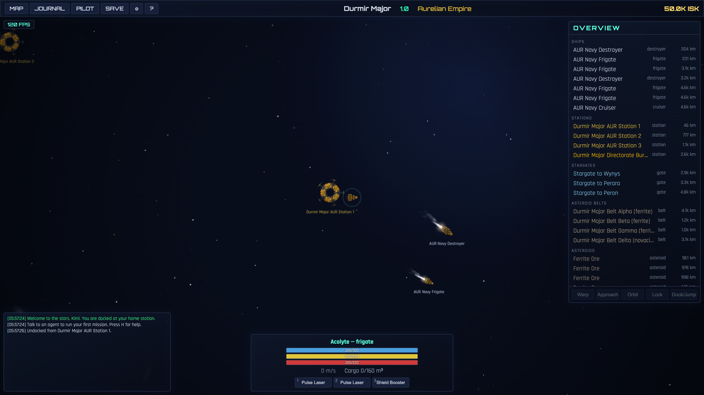
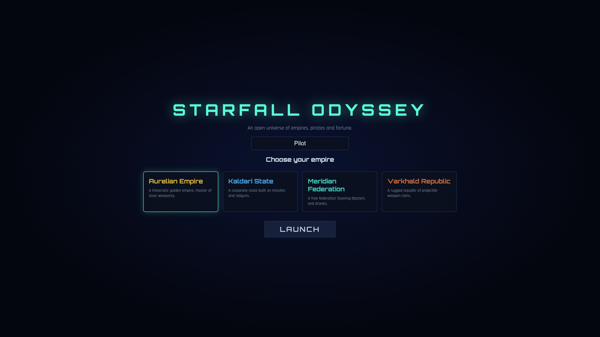
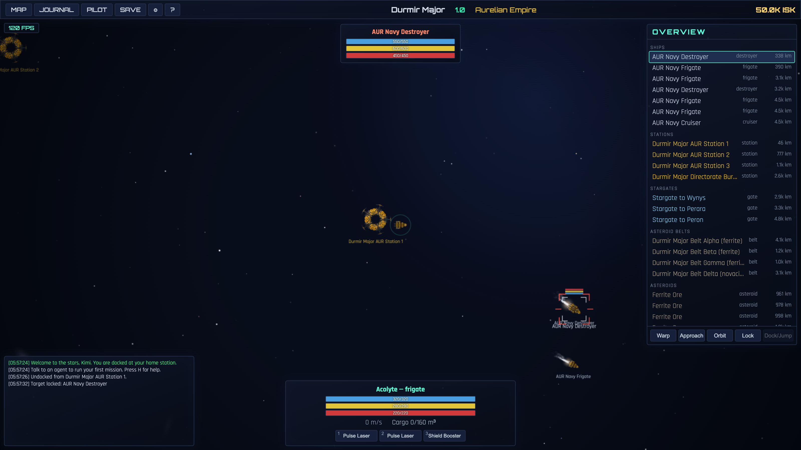
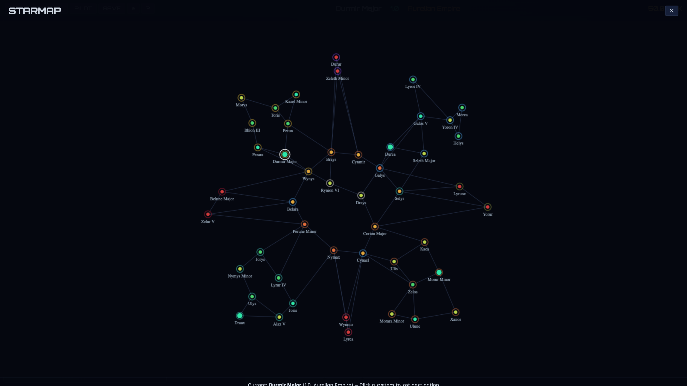
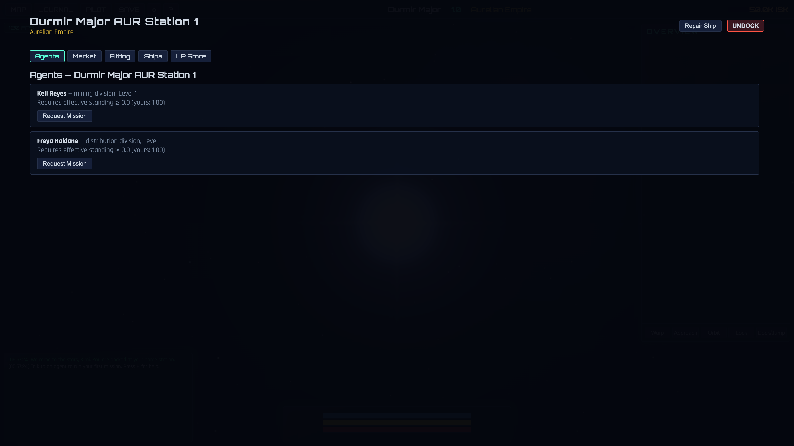

<div align="center">

# 🌠 STARFALL ODYSSEY

**An open universe of empires, pirates and fortune — rebuilt in 3D with Unity 6.**




This repository contains the Unity 6000.1.10f1 3D remake in `UnityProject/` and keeps
the original JavaScript/Canvas game as the deterministic behavior reference. Gameplay
remains on the XZ plane with EVE-style command controls rather than WASD or six-axis flight.

</div>

## 📸 Screenshots

<table>
  <tr>
    <td><br><sub><b>Choose your empire</b> — four powers, four playstyles</sub></td>
    <td><br><sub><b>Lock & engage</b> — shield → armor → hull combat</sub></td>
  </tr>
  <tr>
    <td><br><sub><b>48 star systems</b> — high-sec empires to null-sec pirate space</sub></td>
    <td><br><sub><b>Stations</b> — agents, market, fitting, ships & LP store</sub></td>
  </tr>
</table>

## 🛰️ Unity 6 3D remake

- Open `UnityProject/` with exactly **Unity 6000.1.10f1**.
- The project uses URP, Input System, Cinemachine 3.1.5, ProBuilder 6.0.8,
  Newtonsoft JSON 3.2.1 and MCP for Unity 10.1.0.
- Start from `Assets/Starfall/Scenes/Bootstrap.unity`; runtime scenes are
  `Bootstrap`, `MainMenu`, `Space`, and `Station`.
- The deterministic simulation runs at 20 Hz independently of rendering and Unity Physics.
- A release build is produced as a macOS Universal IL2CPP application under
  `UnityProject/Builds/macOS/STARFALL ODYSSEY.app`.

Unity tests are available from **Window → General → Test Runner**. The current acceptance
suite contains 51 EditMode and 11 PlayMode tests covering generation, gameplay, saves,
station services, runtime navigation, and all 18 ship prefabs.

Third-party model, material, and font licenses are recorded in
[`THIRD_PARTY_NOTICES.md`](THIRD_PARTY_NOTICES.md).

## 🌐 Run the preserved browser original

```bash
cd starfall-odyssey   # this directory
python3 -m http.server 8000
# then open http://localhost:8000 in your browser
```

(Any static file server works. Opening `index.html` via `file://` will NOT work because ES modules require HTTP.)

## ✅ Test

```bash
npm test            # unit + integration tests (Node, no browser needed)
npm run test:repeat # run both deterministic suites 100 times
node tests/run.mjs          # logic unit tests
node tests/integration.mjs  # headless gameplay simulation
```

## 🌌 The Universe

- **48 procedurally generated star systems** connected by stargates, spread across
  high-security empire space, a low-sec ring, and null-sec pirate regions.
- **Four empires**: Aurelian Empire (lasers), Kaldari State (missiles/railguns),
  Meridian Federation (blasters), Varkhald Republic (projectiles).
- **Four pirate factions** preying on the empires, the humanitarian **Sisters of the Veil**,
  and **The Directorate** — the universal police force that answers crime in high-sec.
- Every system has a **star, planets, moons, asteroid belts, stations and stargates**,
  plus **NPC patrols** matched to the local faction (navy in empire space, pirates in
  low/null-sec, gate camps in null-sec).

## 🎮 Gameplay

- **Standings**: every faction remembers what you do. Killing ships lowers your standing
  with their faction (and, via derived standings, shifts how their friends and foes see
  you). NPCs react accordingly: pirates attack on sight unless you've earned their trust;
  empire navies hunt pilots below -5; criminals get a visit from The Directorate.
- **Agents & missions**: stations host agents in three divisions —
  **Security** (combat), **Distribution** (hauling) and **Mining** (ore quotas).
  Higher-level agents require higher standing. **Every 5 completed missions for a
  faction unlocks a storyline mission** with major rewards.
- **Combat**: lock targets, orbit, fire lasers/railguns/blasters/autocannons/missiles.
  Shield → armor → hull damage model, shield regen, active tank modules, fleeing pirates.
- **Mining & economy**: mine three ore tiers from belts; prices vary per station and
  rise in dangerous space. Buy/sell modules and ships on the market.
- **Ships & fitting**: 18 hulls across frigate/destroyer/cruiser/battleship classes,
  high/mid/low slot fitting, LP store with faction loyalty rewards.
- **Save/load**: autosave on dock & jump, 3 manual slots, JSON export/import.
- **Settings**: real-time FPS meter (top-left corner), graphics quality presets
  (low/medium/high — scales starfields, nebulae, particles), and procedural
  Web Audio sound effects with volume/mute. Persisted in localStorage.

## ⌨️ Controls

The Unity remake currently supports selection, right-drag orbit, wheel zoom, V/X focus,
W/L/D, modules 1–9, and M/J/C/H through the 3D HUD. The complete table below documents
the preserved browser original; its right-click context menu, double-click approach, and
Esc panel shortcut are not yet fully exposed by the Unity UI.

| Key | Action |
|---|---|
| Click (overview/canvas) | Select object |
| Right-drag | Rotate camera (EVE-style) |
| Right-click object | Context menu (warp / approach / orbit / lock / look at / dock) |
| Double-click space | Fly to that point |
| V | Camera tracks selected object (again / X to release) |
| X | Reset camera to your ship |
| W | Warp to selected |
| L | Lock target |
| D | Dock / jump stargate (in range) |
| 1–9 | Toggle ship modules |
| M / J / C | Starmap / Journal / Pilot sheet |
| Mouse wheel | Zoom |
| Esc | Close panels |

## 📁 Project layout

```
index.html            entry point
UnityProject/         Unity 6000.1.10f1 URP 3D remake
css/style.css         UI theme
assets/               bitmap art (ships/stations/FX) — see assets/ATTRIBUTION.md
screenshots/          in-game captures used by this README
js/core/              rng, utils, game state, save serialization, localStorage, settings, audio
js/data/              factions & standing matrix, ships/modules/items, universe generator
js/systems/           standings, economy, combat, NPC AI, missions (pure logic)
js/render/            canvas renderer, asset loader, sprite factory (bitmap art composed
                      at boot; procedural fallback for missing assets), particle effects
js/ui/                HUD, overview, station screens, starmap, dialogs, settings
tests/                Node test suites (no DOM required)
tools/                fetch_assets.sh (re-download art), sprite_preview.html (art check)
```

## 🙏 Credits

- Ship & station art by **MillionthVector** (Alan Guyant) —
  [millionthvector.blogspot.com](https://millionthvector.blogspot.com/p/free-sprites.html), CC-BY 4.0
  (rotated/scaled/hue-shifted at runtime).
- Particle textures by **Kenney** — [kenney.nl/assets/particle-pack](https://kenney.nl/assets/particle-pack), CC0.
- Everything else (planets, stars, asteroids, galaxies) is procedurally generated at boot.

---

Design notes & simplifications: item hangar and ship cargo are global (not per-station);
mission turn-in for combat missions is remote via the journal; NPC pirates fly hulls of
their neighboring empire with faction colors.
